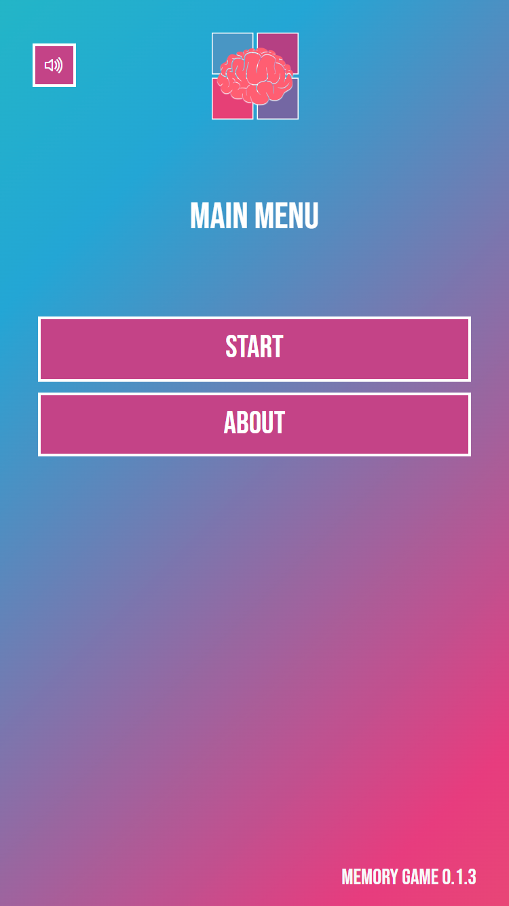
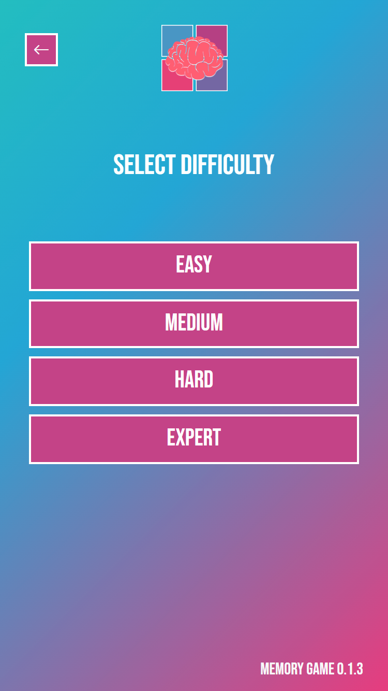
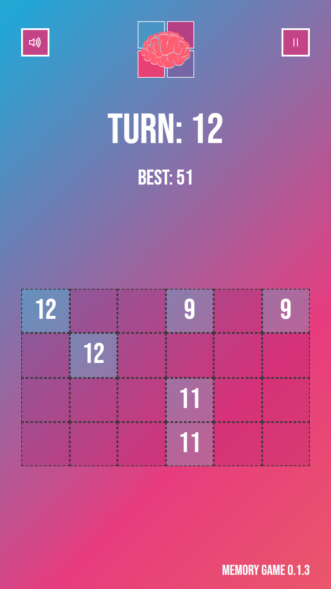

    <h1 align="center">Memory Game</h1>
    

        How good are you at remembering? Let's find out! 
        Memory Game it's the classical game where you have to pick matching pairs of blocks. 
        It's a Progressive Web App, that means you can install it on Android, iOS, Windows, Mac and Linux, despite being a web application.
    

 

    
    
    
     
     

    
    
    
    

 

## ⚡️ Quick start

---

1. First, download and install **NODE**.

2. Then just clone the repo.  
   <code>git clone https://github.com/coding-nerfilio/memory-game.git</code>

3. Install dependencies using npm or yarn. 
   <code>
   npm i  
   yarn
   </code>

4. Run the project using react-scripts  
   <code>
   npm start 
   yarn start
   </code>
